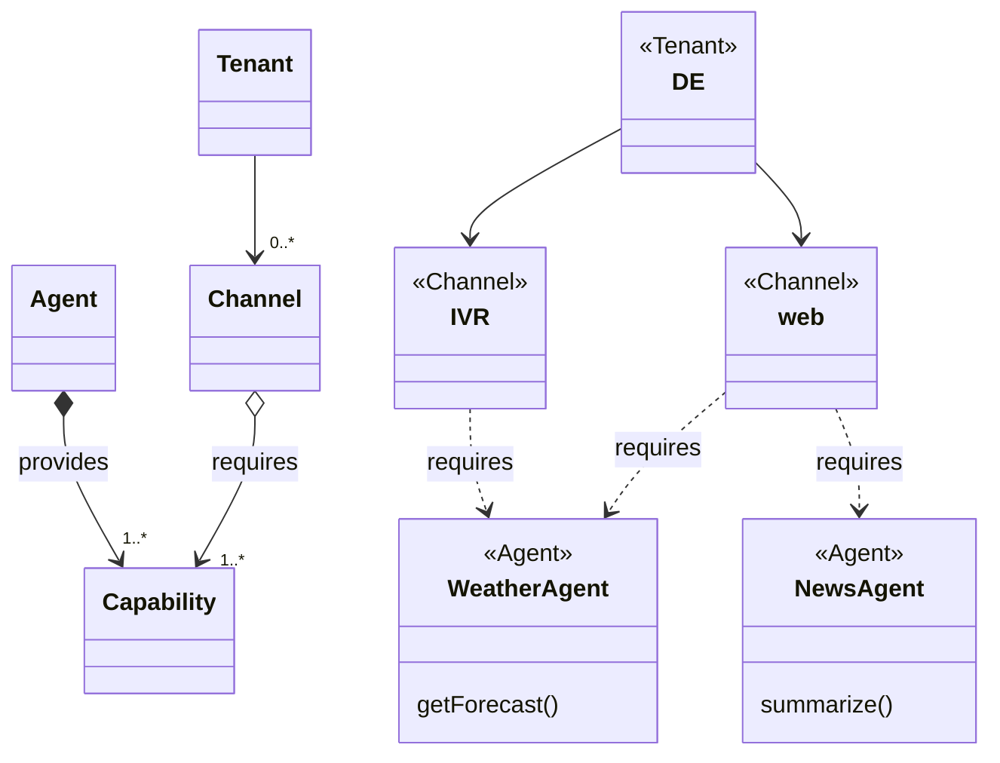

# LMOS Control Plane

The Kubernetes control plane is the central component of a Kubernetes cluster, responsible for managing the overall system, ensuring the desired state of the applications, and orchestrating the resources. 

The LMOS Control Plane extends the Kubernetes control plane to manage and orchestrate intelligent agents. It builds upon Kubernetes' native capabilities while adding specific features to support the development, deployment and management of AI agents.

**Custom Resource Definitions (CRDs) for Agents:** LMOS introduces a new resource type called **Agent**. This allows agents to be treated as first-class citizens within the Kubernetes ecosystem, similar to pods and services, enabling their discovery and lifecycle management. The Agent resource stores agent metadata within the Kubernetes registry, ensuring that essential information about each agent is easily accessible via the Kubernetes API.

**Custom Resource Definitions (CRDs) for Channels:**  LMOS allows agents to form groups, which are called **Channel**. Channels can be tenant-based or task-specific. Agents can be wired to multiple channels.

**Custom Resource Definitions (CRDs) for ChannelRoutings:** LMOS introduces a new resource type known as **ChannelRouting**. This resource is created by the operator when a channel is successfully resolved. The ChannelRouting resource specifies the agents that are wired to the channel, allowing the LMOS Router to effectively distribute tasks among them. 

## LMOS Operator
The **LMOS Operator** is a Kubernetes operator designed to dynamically resolve Channel requirements based on the capabilities of installed Agents within a Kubernetes cluster (environment). The main purpose of the operator is to create channel routing resources which are then used by the LMOS Router component.

The concept of the operator is heavily inspired by OSGi's Capability Model. In OSGi, modules (or bundles) provide and require capabilities, which are then resolved at runtime to manage module dependencies. The OSGi Capability Model is built around two key concepts:

- **Capabilities:** Represent features or services that a module (bundle) provides.
- **Requirements:** Specify what capabilities a module requires to function properly.

The OSGi framework includes a resolver that calculates a set of resources based on a set of requirements. This allows for dynamic resolution of dependencies at runtime, enabling flexible and modular software architectures. The OSGi Capability Model therefore provides a robust foundation for building a modular, dynamic and adaptable system. We believe this concept is valuable in designing the LMOS operator, which needs to manage complex dependencies between Channels and Agents in a distributed environment.

In LMOS a “Channel” refers to a digital interface that enables communication between an AI system and its users. Channels can be diverse, such as web, mobile apps, IVR systems, or messaging platforms, each potentially requiring different sets of capabilities.

For instance, a web channel might need a comprehensive set of customer support capabilities, while an IVR channel might only start with a subset of the customer support capabilities. The following diagram illustrates the relationship between channels and agents in LMOS. Each tenant can have multiple channels. In the environment, multiple agents can be installed, each providing one or more capabilities to support the required functionalities of the channels.

The LMOS Operator enables defining which capabilities should be provided through channels and dynamically resolves which Agents are providing these capabilities. This dynamic resolution ensures that the right capabilities are always available in the Kubernetes cluster (environment). If the operator cannot resolve all required capabilities of a channel, the channel would be unresolved and the changes would not be activated. If the channel can be resolved, the operator is created a ChannelRouting resource which can be used by the LMOS Router.

#### Key Features:
- **Dynamic Capability Resolution**: The Operator dynamically resolves which agents have the required capabilities for specific channels (e.g., web, mobile, IVR).
- **Advanced Deployment Strategies**: It supports **canary releases** to gradually roll out new agent features.
- **Channel Reconciler**: Watches for changes in channel resources and triggers reconciliation, matching capabilities with agents.

The following diagram illustrates how the lmos-operator dynamically manages and resolves capabilities within a Kubernetes environment. It shows the interaction between Channel, Agent, Repository, and the reconciler processes to ensure that required capabilities are matched with installed Agent resources.

