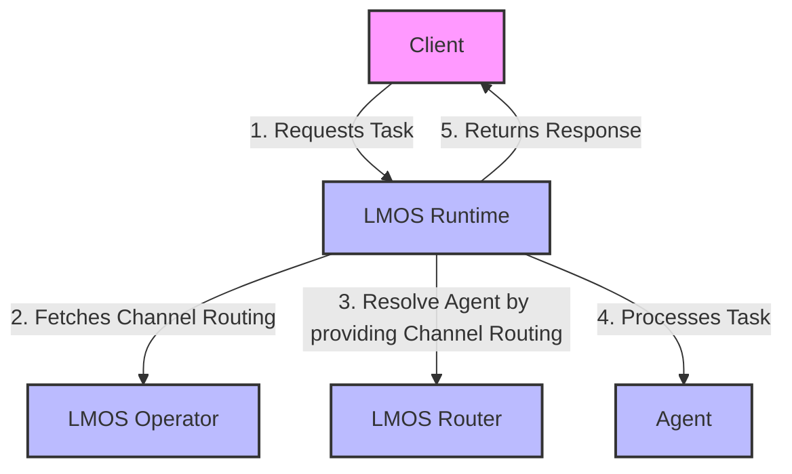

# LMOS Runtime

The **LMOS Runtime** orchestrates collaboration between multiple AI agents. For now the Runtime can only forward a task to one specific agent, but the supported collaboration modes can be enhanced over time.

The component is designed to manage and route tasks to the most suitable agents based on their capabilities. It leverages the LMOS Operator and LMOS Router to dynamically resolve and distribute tasks to the appropriate agents. This project extends the functionalities of the original lmos-operator and lmos-router by integrating them into a cohesive runtime environment.

The LMOS Runtime fetches the channel routings created by the LMOS Operator and uses the LMOS Router to dynamically resolve the most appropriate agent for each task. The task is then forwarded to the selected agent and the response is returned to the client.

