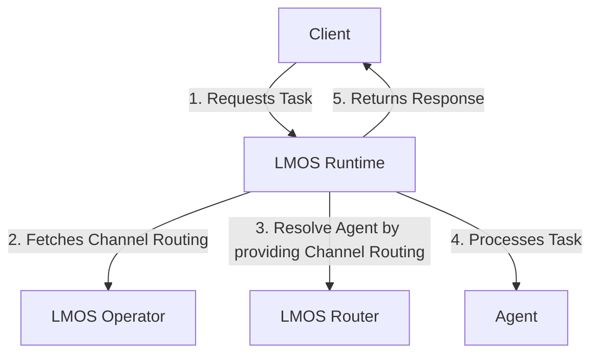

# LMOS Runtime

The **LMOS Runtime** is a library which orchestrates collaboration among multiple AI agents. Currently, it is designed to forward tasks to a single specific agent, although the capability for enhanced collaboration modes may be developed in the future.

This component is built to efficiently manage and route tasks to the most suitable agents based on their capabilities. It leverages the LMOS Operator and LMOS Router to dynamically resolve and distribute tasks effectively. This component expands upon the functionalities of the LMOS Operator and LMOS Router by integrating them into a cohesive runtime environment.

The LMOS Runtime retrieves channel routings created by the LMOS Operator and utilizes the LMOS Router to determine the most appropriate agent for each task. Once the suitable agent is identified, the task is forwarded to them, and the response is returned to the client.

