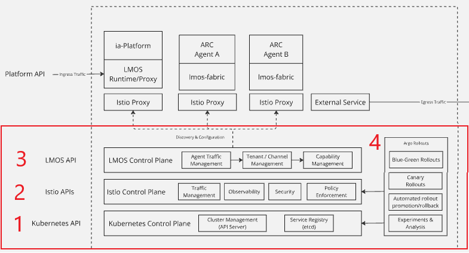
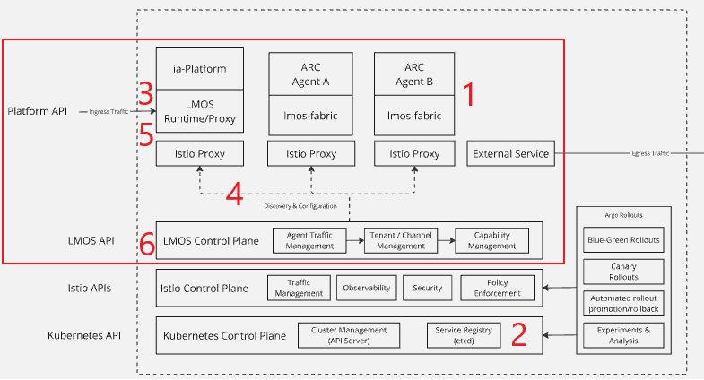

# Architecture

## LMOS in the CNCF Ecosystem

LMOS (Language Model Operating System) currently addresses the **application layer**, focusing on **AI agent collaboration and lifecycle management** in the cloud-native environment. 

### 1. Kubernetes for Orchestration & Scalability

 Kubernetes serves as the foundation for LMOS, providing a platform to orchestrate and scale AI agents efficiently. It handles resource allocation, pod management, and agent scaling.

### 2. Istio for Traffic Management & Security

Traffic Management: LMOS leverages Istio to route traffic between AI agents. Istio’s service mesh capabilities ensure efficient traffic distribution through intelligent routing and load balancing. Istio enables canary rollouts, allowing LMOS to test new agent versions by sending a portion of traffic to updated agents while minimizing risks to production environments.

Security:

   * mTLS (Mutual TLS): Istio secures inter-agent communication with mTLS, ensuring that agents communicate over encrypted channels.
   * Role-Based Access Control (RBAC): Istio enforces access control, ensuring only authorized agents can interact with other AI agents.

### 3. LMOS Control Plan for Agent Lifecycle Management

LMOS Control Plane extends Kubernetes, adding custom logic for AI agent orchestration such as Agent traffic routing and Tenant/Channel management .

### 4. ArgoCD & GitOps for Continuous Delivery
ArgoCD and Argo Rollouts implement GitOps workflows to automate the deployment of agents and perform controlled, automated canary releases. This allows for seamless updates to AI agents with minimal manual intervention.

## Core Components of LMOS

To realize its vision of simplifying AI agent development, LMOS introduces several core components:

### 1. Agent ReaCtor

LMOS offers a simple yet powerful Kotlin framework called [Agent ReaCtor (ARC)](https://lmos-ai.github.io/arc/) for developers of all skill levels to build intelligent AI agents. Built on the JVM and Kotlin for best-in-class performance, ARC delivers rapid prototyping, and seamless collaboration between developers and data scientists

### 2. Agent Registry

The **Agent Registry** is reusing the Kubernetes Service registry and serves as a centralized hub for storing and managing AI agents' metadata enabling agent discovery and collaboration.

### 3&4. LMOS Runtime

The **LMOS Runtime** orchestrates collaboration among multiple AI agents. Currently, it is designed to forward tasks to a single specific agent, although the capability for enhanced collaboration modes may be developed in the future.

This component is built to efficiently manage and route tasks to the most suitable agents based on their capabilities. It leverages the LMOS Operator and LMOS Router to dynamically resolve and distribute tasks effectively. This component expands upon the functionalities of the LMOS Operator and LMOS Router by integrating them into a cohesive runtime environment.

The LMOS Runtime retrieves channel routings created by the LMOS Operator and utilizes the LMOS Router to determine the most appropriate agent for each task. Once the suitable agent is identified, the task is forwarded to them, and the response is returned to the client.

#### Key Aspects:
- **Collaborative Multi-Agent Management**: Ensures agents collaborate to resolve complex tasks.
- **Capability-Based Task Assignment**: Dynamically assigns tasks to the most capable agents based on their registered capabilities.
- **Integration with LMOS Operator and Router**: The Runtime works closely with the Operator and Router to manage agent task assignments and memory sharing.

### 5. LMOS Router

The **LMOS Router** is a vital component of the LMOS architecture. It utilizes agent metadata to identify the most suitable agent for a given task based on their capabilities. The Router supports three methods:

#### Matching Techniques:
- **LLM-based approach:** Uses a language model to understand and match a task with agent capabilities.
- **Vector-based approach:** Uses semantic similarity to find the most suitable agent for a task.
- **Hybrid approach:** Extracts abstract requirements from the query using an LLM and then searches for an agent using semantic similarity. 

### 6. LMOS Operator

The **LMOS Operator** is a Kubernetes operator which extends the Kubernetes Control plane with new custom resource definitions.

#### Key Features:
- **Dynamic Capability Resolution**: The Operator dynamically resolves which agents have the required capabilities for specific channels (e.g., web, mobile, IVR).
- **Advanced Deployment Strategies**: It supports **canary releases** to gradually roll out new agent features.
- **Channel Reconciler**: Watches for changes in channel resources and triggers reconciliation, matching capabilities with agents.

